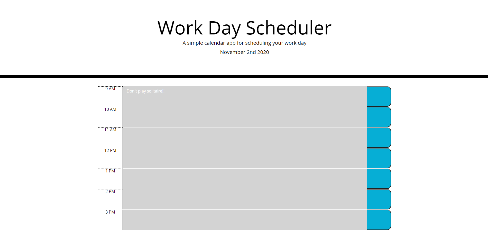

# 05 Third-Party APIs: Work Day Scheduler

DEPLOYED APPLICATION: https://nickpasch.github.io/5-workDayScheduler/

This application allows any given user to plan their day within the standard work day hours of 9 AM to 5 PM. When the user loads the page, they will be presented with the current day, powered by moment.js. The text boxes that the user can enter text in, which is saved in local storage, are color coded so that if they are yet to pass in a day, they will be green. If they have already passed, red. This functionality also utilizes moment.js. When the user clicks the blue button to the right of th text box, it will save what they have entered into the text box in local storage, so that they can refer back to if the tab closes for any reason.

